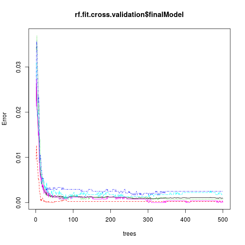
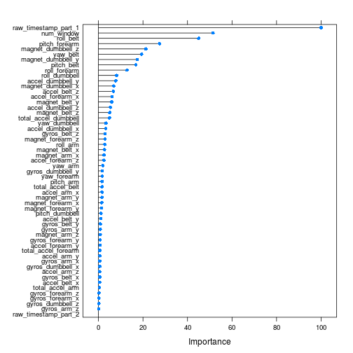
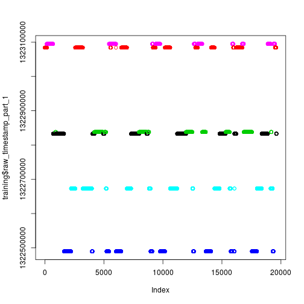
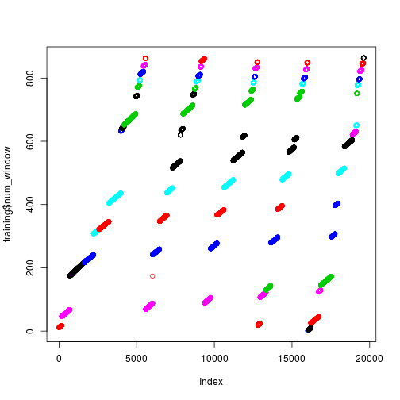

## Introduction
This report is my proposal for the Coursera's Pratical Machine Learning course, part of the Data Science Specialization.

The subject of this project is the analysis of physical performance data collected on 6 participant to the [Groupware](http://groupware.les.inf.puc-rio.br/har) project. Some metrics were collected on the participants during physical exercices they've been asked to execute. The differiciation between the exercices has been introduced by explaining distinctly how to perform them, thus 1 participant had the right explaination, the others had different wrong ones.

The data have been opened sourced, but we'll analyse the two samples below, where the training set contains a column `classe` that gives the indication about how the exercice was performed:
* [training data](https://d396qusza40orc.cloudfront.net/predmachlearn/pml-training.csv)
* [unclassified observations](https://d396qusza40orc.cloudfront.net/predmachlearn/pml-testing.csv)

The goal of this report is then to provide a model trained and validation on the training set in order to classify the second set.

## Executive Summary
The very first step made in this analysis was to load the data and take a look at their caracteristics. What was quickly obvious is that most of the 160 columns are numeric and represent data collected from the sensors, however most of the metrics were empty of non interpretable because the number of missing data was more than 95% (of 19622 rows).

So the analysis gets rid of them, that is all 100 columns that had this highly sparsed data, but also the `X` variable (which is the index of the row) and finally all non numeric columns.
The `X` column was removed because, it had a too higher (100) score in the variable importance of the final model (random forest, see below) and its due to the fact that the rows are ordered (or grouped by) the name of the participant.

After having cleaned the data, given the number of feature left (60), I ran a random forest on a subset of the training data a cross validation of 10 folds and `R`'s the default number of tree built (500). It took a while, so the model has been saved locally to safe further analyses if needed. The resulting model was highly accurate with an OOB estimated at less than 0.09%.

On the validation set, the confusion matrix tells us that the accuracy is impressvly high, with a 0.9993 score.

All that, let us think that the current metrics taken on the participants, even after removing most of them, are sufficiant to detect the way the participant were told how to do the exercices. Which, in a sense, has quite good sense since the metrics taken were recording the movements, and they were all different.

## Analysis
The full analysis is available and reproductible by running the script `analysis.R`. However, here we'll present the essence of it.

First we load the data provided in the exercice's text, then we perform some cleaning on it (NA's and get rid of unrelevant variables).


```r
training.url <- "https://d396qusza40orc.cloudfront.net/predmachlearn/pml-training.csv"
testing.url <- "https://d396qusza40orc.cloudfront.net/predmachlearn/pml-testing.csv"
download.file(training.url, destfile="pml-training.csv", method="curl")
download.file(testing.url, destfile="pml-testing.csv", method="curl")

na.strings <- c("", "NA", "#DIV/0!")
training <- read.csv("pml-training.csv", na.strings=na.strings)
testing <- read.csv("pml-testing.csv", na.strings=na.strings)

# "X" is simply the index of the rows so we can get rid of it
training <- training[, -1]

dd <- dim(training)
# which variables have NA's in it => take out the freq
with.nas <- sort(Filter(function(x) x > 0, 
                        sapply(training, function(x)sum(is.na(x))) / dd[1]))
# those with high freq will be discarded
with.too.many.nas <- Filter(function(x) x > 0.95, with.nas)
# percentage of almost empty values
#(length(with.too.many.nas) / dd[2])*100

# now we remove the columns out of the datasets
training.neat <- training[, -which(names(training) %in% names(with.too.many.nas))]
testing.neat <- testing[, -which(names(testing) %in% names(with.too.many.nas))]

# take out the classe before removing all non numeric variables
training.classe <- training.neat$classe
non.numeric.cols <- Filter(function(x) !is.numeric(training.neat[, x]), names(training.neat))
# remove all non numeric cols
training.neat <- training.neat[, -(which(names(training.neat) %in% non.numeric.cols))]
training.neat <- data.frame(classe=training.classe, training.neat)

# remove unecessary variables
testing.neat <- testing.neat[, -(which(names(testing.neat) %in% non.numeric.cols))]

#summary(training.neat)
dim(training.neat)
```

```
## [1] 19622    56
```

For the sake of sanity (and to easily present a confusion matrix of the training model) we create two samples out of the classified, cleaned data set.


```r
# let's split into a training set and validation set, 
# even though cross validation will be used 
# -- so we can check easily the OOB
inTrain <- createDataPartition(training.neat$classe, p=0.70, list=FALSE)
training.set <- training.neat[inTrain,]
validation.set <- training.neat[-inTrain,]
```

Now we can train our random forest on the 70% training set, using this code that will make use of the `caret` generic interface.

```r
  # train a random forest on the cleaned training set with 10 folds
  rf.fit.cross.validation <- train(
    training.set$classe ~ .,
    data=training.set, 
    method="rf",
    trControl=trainControl(method = "cv", number = 10)
  )
```
Although we could run it from this R markup, we will load the result locally because it can (will) take a while to train.

```r
  load(file="rf.fit.cross.validation_wo_X.RData")
```
This gives access to the `rf.fit.cross.validation` variable, being our trained random forest. Which model being the one that gave us the great results presented in the executive summary.

Here is the final model.

```r
print(rf.fit.cross.validation$finalModel)
```

```
## 
## Call:
##  randomForest(x = x, y = y, mtry = param$mtry) 
##                Type of random forest: classification
##                      Number of trees: 500
## No. of variables tried at each split: 28
## 
##         OOB estimate of  error rate: 0.09%
## Confusion matrix:
##      A    B    C    D    E class.error
## A 3905    1    0    0    0   0.0002560
## B    1 2656    1    0    0   0.0007524
## C    0    3 2390    3    0   0.0025042
## D    0    0    2 2248    2   0.0017762
## E    0    0    0    0 2525   0.0000000
```

```r
plot(rf.fit.cross.validation$finalModel)
```

 

We can validate that the error rates are very very low and the confusion matrix looks impressively good.

Since, we've separated the initial training data, we can have a look at the confusion matrix on the validation set. This will confort us for the last phase which consist of the classification of observed data and the sublission to the course webpage on Coursera.

```r
confusionMatrix(predict(rf.fit.cross.validation, 
                        newdata=validation.set), validation.set$classe)
```

```
## Confusion Matrix and Statistics
## 
##           Reference
## Prediction    A    B    C    D    E
##          A 1674    0    0    0    0
##          B    0 1139    1    0    0
##          C    0    0 1025    0    0
##          D    0    0    0  964    3
##          E    0    0    0    0 1079
## 
## Overall Statistics
##                                     
##                Accuracy : 0.999     
##                  95% CI : (0.998, 1)
##     No Information Rate : 0.284     
##     P-Value [Acc > NIR] : <2e-16    
##                                     
##                   Kappa : 0.999     
##  Mcnemar's Test P-Value : NA        
## 
## Statistics by Class:
## 
##                      Class: A Class: B Class: C Class: D Class: E
## Sensitivity             1.000    1.000    0.999    1.000    0.997
## Specificity             1.000    1.000    1.000    0.999    1.000
## Pos Pred Value          1.000    0.999    1.000    0.997    1.000
## Neg Pred Value          1.000    1.000    1.000    1.000    0.999
## Prevalence              0.284    0.194    0.174    0.164    0.184
## Detection Rate          0.284    0.194    0.174    0.164    0.183
## Detection Prevalence    0.284    0.194    0.174    0.164    0.183
## Balanced Accuracy       1.000    1.000    1.000    1.000    0.999
```
As we can see, the accuracy is rather high and gives us a error rate almost neglictable.

Now that we validated the model, we can head into it to see which variable are important, like so

```r
plot(varImp(rf.fit.cross.validation))
```

 
An interpretation could, at least, be that we could also get rid of the timestamps since they are highly correlated with the user (and thus with the index), same goes for the `num_window` one. So the variance increase with different data set, we'll know where adaptation can be made. See the three pictures below.

```r
plot(training$raw_timestamp_part_1, col=training$user_name)
```

 

```r
plot(training$raw_timestamp_part_2, col=training$user_name)
```

 

```r
plot(training$num_window, col=training$user_name)
```

 


## Submission
The project requires us to submit our prediction for 20 observations. For that, we'll again use the `caret`'s `predict` function.

```r
test_prediction<-predict(rf.fit.cross.validation, newdata=testing.neat)
# show the prediction for the non classified data
test_prediction
```

```
##  [1] B A B A A E D B A A B C B A E E A B B B
## Levels: A B C D E
```

Since this process is rather boring (needs to create a file per submission) I'll use the function, gently, provided by the professor.

```r
  pml_write_files = function(x){
    n = length(x)
    for(i in 1:n){
      filename = paste0("problem_id_",i,".txt")
      write.table(x[i],file=filename,quote=FALSE,
                  row.names=FALSE,col.names=FALSE)
    }
  }
  pml_write_files(test_prediction)  
```


